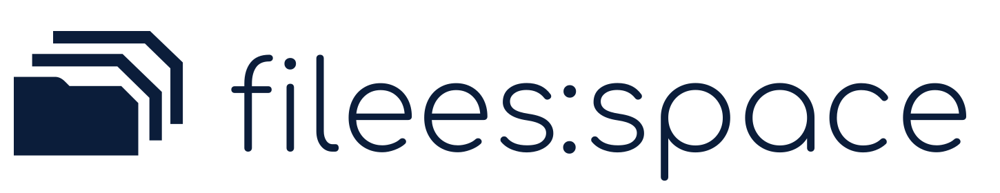

<p align="center">
  <picture>
    <source media="(prefers-color-scheme: dark)" srcset="branded-assets/filees-space-svg-pack/filees-space-monochrome-white.svg">
    
  </picture>
</p>

# FileES

*[English](README.md) | Polski*

FileES przechowuje projekty na Twoim serwerze, synchronizuje je między
komputerami, zachowuje ich historię i pomaga ludziom pracować na tych samych
plikach. Zwykłe foldery, własne programy, Twoje zasady. Pod spodem działa
Apache Subversion jako transport i magazyn; użytkownik nie musi o tym wiedzieć.

Strona serwerowa jest przeznaczona dla OpenBSD. Aplikacje desktopowe działają
na Windows i Linuksie, a aplikacja na Androida wysyła zdjęcia i pliki
z telefonu.

> ## Wczesny dostęp
>
> FileES jest we wczesnym dostępie. Podpisane wydania są publikowane i używane
> w prawdziwej pracy, ale **bez żadnych gwarancji** — ani poprawności, ani
> bezpieczeństwa, ani integralności danych — i bez wsparcia.
>
> - **Dwa kanały wydań.** *Beta* to odebrane wydanie bez funkcji w
>   przygotowaniu; z niej pochodzi wersja w Microsoft Store. *Alfa* dostaje
>   nowe funkcje i poprawki wcześniej.
> - Formaty na dysku, protokoły i polecenia mogą się jeszcze zmieniać między
>   wydaniami.
> - To repozytorium jest **filtrowanym lustrem** repozytorium SVN: kod,
>   podręcznik i pliki readme. Wewnętrzne dokumenty projektowe, plany
>   i raporty z audytów nie są publikowane.
> - Zgłoszenia (issues) i pull requesty nie są oczekiwane i mogą pozostać bez
>   odpowiedzi.

---

## Co robi

- **Zwykłe foldery na Twoim dysku**, synchronizowane z repozytorium na Twoim
  serwerze przez usługę w tle. Dalej pracujesz we własnych programach.
- **Historia każdego pliku**: każdą opublikowaną zmianę można obejrzeć
  i przywrócić, także dawno usunięte pliki.
- **Wspólna praca na plikach binarnych** (rysunki, modele, dokumenty): plik
  można *wypożyczyć* do edycji, żeby dwie osoby nie nadpisywały sobie pracy;
  pozostali widzą go tylko do odczytu, dopóki nie zostanie opublikowany
  i oddany.
- **O konflikcie decydujesz Ty**, a kopia lokalna zostaje zachowana, nigdy nie
  jest po cichu nadpisana.
- **Udostępnianie**: repozytoria dzielone między ludzi i komputery, publiczne
  linki do pobierania (opcjonalnie z hasłem albo kodem wysyłanym e-mailem)
  oraz linki do wysyłania plików dla osób bez konta.
- **Aplikacja na Androida**: obserwowane foldery w telefonie trafiają do
  wybranego repozytorium; repozytoria można przeglądać i pobierać z nich
  pliki.
- **Podpisane aktualizacje** aplikacji desktopowych, serwera i aplikacji na
  Androida, z podpisanych kanałów wydań.

## Skąd wziąć FileES

Wszystko jest na **[filees.space/download](https://filees.space/download/)**
(beta) i **[filees.space/download-alpha](https://filees.space/download-alpha/)**
(alfa), każde wydanie z SHA-256 i krótką, podpisaną listą „co nowego”.

| Co | Skąd |
|---|---|
| Windows | [Microsoft Store](https://apps.microsoft.com/detail/9P0J1BRL5K77) (beta, aktualizacje przez Sklep) albo instalator MSI ze strony pobierania. Zainstaluj jedno z nich: każde proponuje usunięcie drugiego. |
| Linux | AppImage ze strony pobierania. Pierwsze uruchomienie instaluje FileES w katalogu domowym; kolejne wersje przychodzą podpisanym kanałem aktualizacji. |
| Android | APK ze strony pobierania; aplikacja sprawdza podpisany kanał i może się sama aktualizować. |
| Serwer | Paczka dla OpenBSD/amd64 ze strony pobierania; instalacja opisana w [podręczniku](https://manual.filees.space). Kolejne aktualizacje przychodzą z podpisanego kanału przez `filees-install`. |

Aplikacja desktopowa potrzebuje serwera FileES i zaproszenia od jego
administratora; sama instalacja nie daje miejsca na dane. Żeby najpierw się
rozejrzeć, użyj przycisku **Demo** w świeżo zainstalowanej aplikacji: otwiera
czasowe konto na serwerze demonstracyjnym, z kodem wysłanym na Twój adres
e-mail.

## Wymagania

- **Windows:** Windows 10 w wersji 2004 lub nowszej albo Windows 11,
  z WebView2 Runtime (wbudowanym w Windows 11). Nie są potrzebne OpenSSH,
  Subversion ani VBScript: klienci SSH i Subversion są wbudowani.
- **Linux:** x86-64 z GTK 4 (4.10 lub nowszym) i WebKitGTK 6.0, pulpit
  z obsługą zasobnika (SNI) — na GNOME rozszerzenie AppIndicator — oraz sesja
  systemd użytkownika. Klienci SSH i Subversion są wbudowani.
- **Serwer:** OpenBSD 7.9/amd64 jako główna platforma i wzorzec
  bezpieczeństwa, systemowy `sshd` (FileES nie otwiera własnego portu),
  niezależnie zainstalowany `svnserve`, osiągany jako `svnserve -t` przez
  SSH, oraz przekaźnik SMTP do kodów wysyłanych e-mailem. Paczkę serwera dla
  Linux/amd64 można zbudować, ale bez ograniczeń `pledge`/`unveil` z OpenBSD.

## Dokumentacja

- **[manual.filees.space](https://manual.filees.space)** — pełny podręcznik po
  polsku i po angielsku: aplikacje desktopowe i na Androida, udostępnianie,
  instalacja serwera, administracja, eksploatacja, bezpieczeństwo
  i architektura.
- **[Strony man](https://manual.filees.space/assets/man/index.html)** — strony
  podręcznika OpenBSD narzędzi serwera w HTML. Te same strony instalują się
  z serwerem (`man filees`) i aktualizują razem z nim; źródła są w
  [docs/man/](docs/man/).
- [manual/](manual/index.html) — podręcznik w kopii w tym repozytorium;
  wersją rozstrzygającą jest strona.
- [USERGUIDE.md](USERGUIDE.md) — od czego zacząć w podręczniku.

## Budowanie ze źródeł

Wspieraną drogą instalacji są gotowe, podpisane wydania. Do budowania ze
źródeł potrzebna jest wersja Go podana w [go.mod](go.mod); testy wymagają też
narzędzi wiersza poleceń Subversion (`svn`, `svnadmin`).

```bash
make verify          # testy Go, wybrane testy wyścigów, go vet i test odzyskiwania SVN
go build ./cmd/filees                 # usługa desktopowa i wiersz poleceń
make pair            # usługa i okno aplikacji, z wersją z VERSION i rewizją SVN
```

Budowanie wydań (MSI i paczka Windows, AppImage Linuksa, paczka serwera
OpenBSD, natywni pomocnicy Subversion i Eksploratora) opisują
[tools/HOWTO-BUILD-CLIENT-RELEASE.md](tools/HOWTO-BUILD-CLIENT-RELEASE.md),
[tools/HOWTO-BUILD-SERVER-BUNDLE.md](tools/HOWTO-BUILD-SERVER-BUNDLE.md),
a podpisywanie i kanały —
[tools/RELEASE_PUBLISHING.md](tools/RELEASE_PUBLISHING.md).

### Co gdzie jest

| Ścieżka | Zawartość |
|---|---|
| `cmd/filees` | usługa desktopowa i wiersz poleceń |
| `cmd/filees-gui-wails` | okno aplikacji i zasobnik (Wails, WebView) |
| `cmd/filees-*`, `internal/` | narzędzia serwera, instalator i aktualizator, narzędzia wydań |
| `pkg/` | wspólny silnik: synchronizacja, commit, kontrakt IPC, klienci SVN i SSH, procesy serwera |
| `public-shares/` | publiczne linki do pobierania i wysyłania (`filees-links`) |
| `android/` | aplikacja na Androida (Kotlin, z klientem mobilnym w Go) |
| `native/` | natywni pomocnicy: runtime Subversion, kotwica w Eksploratorze Windows |
| `packaging/` | instalatory i pakowanie dla Windows, Linuksa, OpenBSD i strony WWW |
| `contracttests/` | testy zgodności kontraktu klient/serwer |
| `docs/man/`, `manual/` | strony man i podręcznik HTML |

Aplikacja desktopowa to dwa procesy: usługa w tle, która odpowiada za
synchronizację, i okno aplikacji, które rozmawia z nią wyłącznie przez
lokalny, wersjonowany kontrakt IPC. Rozdział o architekturze w podręczniku
opisuje obie połowy i serwer.

## Licencja

BSD 2-Clause — zobacz [LICENSE](LICENSE).
